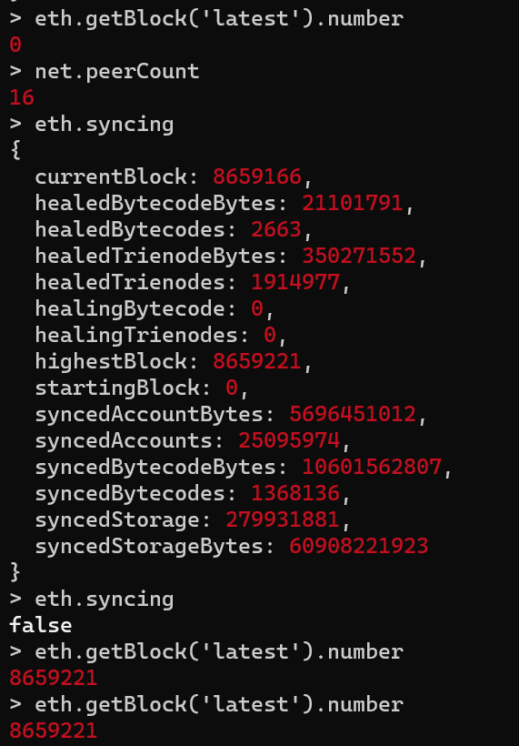
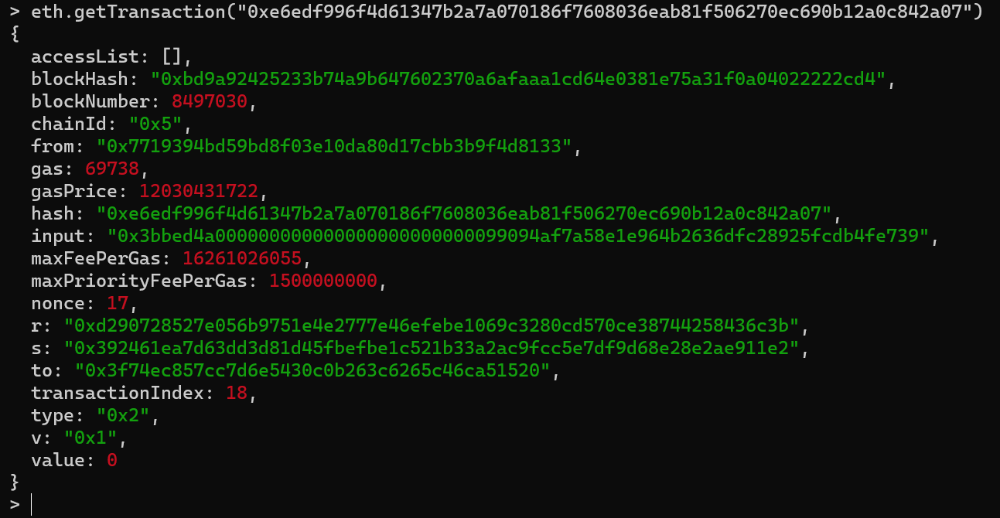
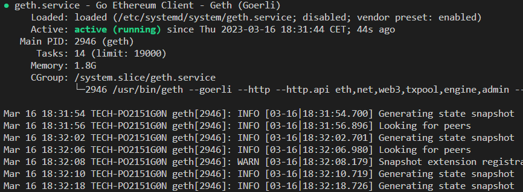
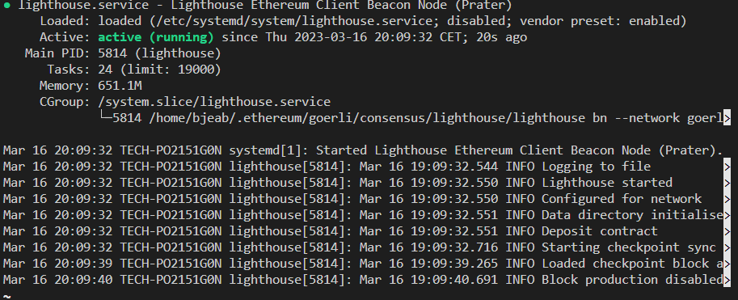

# Run-a-Geth-Node

Guide to setup your machine to join the Goerli/Prater merge testnet

## Tech stack

- Ubuntu 20.04

## Prerequisites

### Update the Software

```bash
# Install prerequisites commonly available.
sudo apt -y install software-properties-common wget curl
# Add the Ethereum PPA and install the Geth package.
sudo sudo add-apt-repository -y ppa:ethereum/ethereum
sudo apt-get update
sudo apt-get install ethereum
```

## Installing Geth

### Execution node

[See : Installing Geth](https://geth.ethereum.org/docs/getting-started)

```bash
sudo apt-get update
sudo apt-get install ethereum
#Check installation
geth –-help
```

<!-- ### Security

[See : Networking security](https://geth.ethereum.org/docs/fundamentals/security)

```bash
sudo apt install ufw
sudo su
ufw default deny incoming
ufw default allow outgoing
ufw allow 30303  comment 'allow P2P traffic goerli'
ufw allow 8551  comment 'execution node'
ufw enable
ufw status
```

Open ports, allow traffic on: SSH(22) ; 8545(HTTP based JSON RPC API) 8546(WebSocket based JSON RPC API) ; 30303(The P2P protocol running the network) ; 30304(The P2P protocol's new peer discovery overlay) ; http ; https ... -->

### Beacon node : Connecting to Consensus Clients

"Geth is an execution client, Historically, an execution client alone was enough to run a full Ethereum node. However, ever since Ethereum swapped from proof-of-work (PoW) to proof-of-stake (PoS) based consensus, Geth has needed to be coupled to another piece of software called a "consensus client"."

[See : Connecting to Consensus Clients](https://geth.ethereum.org/docs/getting-started/consensus-clients)

#### Install

Geth users are required to install and run a consensus client. Otherwise, Geth will not be able to track the head of the chain.

Client : [Lighthouse](https://lighthouse-book.sigmaprime.io/)

```bash
#datadir
cd ~/.ethereum/goerli
mkdir consensus
cd consensus
mkdir lighthouse && cd lighthouse
# Install lighthouse
wget https://github.com/sigp/lighthouse/releases/download/v3.5.1/lighthouse-v3.5.1-x86_64-unknown-linux-gnu.tar.gz
tar xvf lighthouse-v3.5.1-x86_64-unknown-linux-gnu.tar.gz
rm lighthouse-v3.5.1-x86_64-unknown-linux-gnu.tar.gz
#Test the binary
./lighthouse --version
# Generate JWT token file
openssl rand -hex 32 | tr -d "\n" > jwttoken
sudo chmod +r jwttoken
```

### Running Geth & the Consensus Client

```bash
# Run Nodes on the terminal
# Run the execution client, by default :  --syncmode snap
geth --goerli --datadir /home/bjeab/.ethereum/goerli/ --http --http.api eth,net,web3,txpool,engine,admin --authrpc.jwtsecret /home/bjeab/.ethereum/goerli/consensus/lighthouse/jwttoken --metrics --metrics.expensive

# Run the beacon node using lighthouse
cd ~/.ethereum/goerli/consensus/lighthouse

./lighthouse bn --network goerli --execution-endpoint http://localhost:8551 --metrics --validator-monitor-auto --checkpoint-sync-url https://checkpoint-sync.goerli.ethpandaops.io --execution-jwt /home/bjeab/.ethereum/goerli/consensus/lighthouse/jwttoken --http --disable-deposit-contract-sync
```

## Connect to the Geth console and extract last block number

Execution node [sync status](https://geth.ethereum.org/docs/fundamentals/sync-modes)

```geth
geth version
geth --goerli attach
```

Watch the last block with this command:

```geth
> eth.getBlock('latest').number
8659221
```

If the value is 0, it's just charging blocks then use:

```geth
#To watch the current charged block
eth.syncing
#if false => it's updated
```



### Connect to the Geth console and show events data from a specific transaction

Watch a specific transaction with this command:

```geth
# Tx is the transaction
eth.getTransaction("#Tx")
```



### Create a quick Smart Contract and Interact with it

Configure hardhat to deploy a smart contract through your node

```javascript
require("@nomicfoundation/hardhat-toolbox");
require("dotenv").config();
var API_KEY = process.env.API_KEY;
var PRIVATE_KEY = process.env.PRIVATE_KEY;
module.exports = {
  solidity: {
    version: "0.8.17",
    settings : {
      optimizer : {
        enabled: true,
        runs: 200
      }
    },
  },
  networks: {
    goerli: {
      url:`https://goerli.infura.io/v3/${API_KEY}`,
      //url: `https://eth-goerli.g.alchemy.com/v2/${API_KEY}`,
      chainId: 5,
      accounts :[`${PRIVATE_KEY}`],
    },
    goerliPvNode: {
      url:`http://localhost:8545`,
      //url: `https://eth-goerli.g.alchemy.com/v2/${API_KEY}`,
      chainId: 5,
      accounts :[`${PRIVATE_KEY}`],
    },
    mumbai: {
      url:`https://polygon-mumbai.infura.io/v3/${API_KEY}`,
      //url:`https://polygon-mumbai.g.alchemy.com/v2/${API_KEY}`,
      chainId: 80001,
      accounts :[`${PRIVATE_KEY}`],
    },
  },
  gasReporter: {
    enabled: true,
    currency: 'USD',
    gasPrice: 21
  }
};
```

```bash
# Deploy contract
npx hardhat run scripts/deploy.js --network goerliPvNode
```

```cmd
#response
network goerliPvNode
0x0591F951415Dc471Aa948A49E9Fe752ACB028E9B
Tokenization address: 0x10E0640875817EeFe75F3414522Ae9faa334BFca
```

Smart Contract addresse [0x10E0640875817EeFe75F3414522Ae9faa334BFca](https://goerli.etherscan.io/address/0x10e0640875817eefe75f3414522ae9faa334bfca)

## Configuring Geth

[See : Configuring Geth](https://geth.ethereum.org/docs/getting-started/consensus-clients)

<!-- ### Users

Create a 'goeth' user, assign the proper permissions, and where the geth will run

```bash
sudo useradd --no-create-home --shell /bin/false goeth
```

Add admin to the 'goeth' group with read-only privileges

```bash
sudo adduser admin goeth
```

```bash
sudo reboot
```

Create a goeth directory

The owner will be 'goeth'

```bash
sudo chown -R goeth:goeth /mnt/ext/
```

Create the directory

```bash
sudo su - goeth
cd /mnt/ext
mkdir goeth
ls -la
```

Quit the 'goeth' session

```bash
exit
``` -->

### Turning Geth into a service

Create a systemd service config file to configure the Geth node service

```bash
sudo nano /etc/systemd/system/geth.service
```

Paste this configuration file into it and save once done (Ctrl + X, Y, Enter):

``` bash
[Unit]
Description=Go Ethereum Client - Geth (Goerli)
After=network.target
Wants=network.target

[Service]
#User=goeth
#Group=goeth
Type=simple
Restart=always
RestartSec=5
TimeoutStopSec=180
ExecStart=geth \
    --goerli \
    --http \
    --http.api eth,net,web3,txpool,engine,admin \
    --datadir /home/bjeab/.ethereum/goerli/ \
    --metrics \
    --metrics.expensive \
    --pprof \
    --authrpc.jwtsecret=/home/bjeab/.ethereum/goerli/consensus/lighthouse/jwttoken

[Install]
WantedBy=default.target
```

```bash
#(reload to reflect the changes)
sudo systemctl daemon-reload
#(lauch)
sudo systemctl start geth.service
#(check)
sudo systemctl status geth.service
#(to stop/restart)
sudo systemctl stop geth.service
sudo systemctl restart geth.service
#(You can enable/disable the geth service to automatically start on reboot)
sudo systemctl enable geth.service
sudo systemctl disable geth.service
```

To monitor you can check the geth.service status with :

```bash
systemctl status geth
#Or
journalctl -fu geth
sudo journalctl -f -u geth.service -o cat | ccze -A
#Press Ctrl + C to stop showing those messages.
```



### Turning Lighthouse into a service

Create a systemd service config file to configure the Lighthouse consensus node service

```bash
sudo nano /etc/systemd/system/lighthouse.service
```

Paste this configuration file into it and save once done (Ctrl + X, Y, Enter):

``` bash
[Unit]
Description=Lighthouse Ethereum Client Beacon Node (Prater)
Wants=network-online.target
After=network-online.target

[Service]
Type=simple
# User=lighthousebeacon
# Group=lighthousebeacon
Restart=always
RestartSec=5
ExecStart=/home/bjeab/.ethereum/goerli/consensus/lighthouse/lighthouse bn \
    --network goerli \
    --datadir /home/bjeab/.ethereum/goerli/ \
    --http \
    --execution-endpoint http://localhost:8551 \
    --checkpoint-sync-url https://checkpoint-sync.goerli.ethpandaops.io \
    --execution-jwt /home/bjeab/.ethereum/goerli/consensus/lighthouse/jwttoken \
    --metrics \
    --validator-monitor-auto \
    --disable-deposit-contract-sync

[Install]
WantedBy=multi-user.target
```

```bash
#(reload to reflect the changes)
sudo systemctl daemon-reload
#(lauch)
sudo systemctl start lighthouse.service
#(check)
sudo systemctl status lighthouse.service
#(to stop/restart)
sudo systemctl stop lighthouse.service
sudo systemctl restart lighthouse.service
#(You can enable/disable the lighthouse service to automatically start on reboot)
sudo systemctl enable lighthouse.service
sudo systemctl disable lighthouse.service
```

To monitor you can check the lighthouse.service status with :

```bash
systemctl status lighthouse
#Or
journalctl -fu lighthouse
sudo journalctl -f -u lighthouse.service -o cat | ccze -A 
#Press Ctrl + C to stop showing those messages.
```



## Documentation

- [Quicknode installation](https://www.quicknode.com/guides/infrastructure/node-setup/how-to-install-and-run-a-geth-node/)
- [Getting started with Geth](https://geth.ethereum.org/docs/getting-started)
- [Tuto](https://github.com/eth-educators/ethstaker-guides/blob/main/merge-goerli-prater.md)
- [Set up Firewall](https://www.digitalocean.com/community/tutorials/how-to-set-up-a-firewall-with-ufw-on-ubuntu-20-04-fr)
- [go-ethereum](https://github.com/ethereum/go-ethereum)
- [Ethereum public endpoints](https://eth-clients.github.io/checkpoint-sync-endpoints/)
<!-- - <https://geth.ethereum.org/docs/fundamentals/command-line-options>
- <https://consensys.net/blog/teku/teku-and-infura-team-up-to-make-the-fastest-ethereum-2-0-client-sync/>
-<https://ethereum.stackexchange.com/questions/142870/how-do-i-expose-and-beacon-chain-api-securely-over-http-and-test-my-api-works>
- [Tuto Besu/Teku](https://github.com/eth-educators/ethstaker-guides/blob/main/merge-goerli-prater-alt.md)
- <https://ethereum.org/en/staking/pools/>
- <https://lighthouse-book.sigmaprime.io/faq.html>
- <https://geth.ethereum.org/docs/fundamentals/peer-to-peer>

-<https://www.quicknode.com/guides/infrastructure/node-setup/how-to-run-a-hyperledger-besu-node/>

- <https://aubay.udemy.com/course/blockchain-developer/learn/lecture/8798024#overview>
- <https://geth.ethereum.org/docs/getting-started>
- <https://www.alchemy.com/overviews/what-is-a-geth-node-and-how-to-run-one>
- <https://cryptomarketpool.com/getting-started-with-geth-to-run-an-ethereum-node/>
- <https://medium.com/@cvcassano/setting-up-a-full-ethereum-node-with-rpc-and-debug-support-geth-316517a1fdc>
- <https://rpcfast.com/blog/how-to-install-and-run-geth-node>
- <https://dev.to/yongchanghe/tutorial-play-with-geth-go-ethereum-4gic>
- <https://www.youtube.com/watch?v=ftS-SlzCCn4>
- <https://www.youtube.com/watch?v=3H-KmO7Ce4I>
- <https://www.youtube.com/watch?v=DLfSNcs2aW8>
- <https://www.quicknode.com/guides/infrastructure/node-setup/how-to-install-and-run-a-geth-node/>
- <https://github.com/bjeabby1507/Running_a_Bitcoin_node/blob/main/README.md>
- <https://github.com/redek-zelton/TD3---Running-a-GETH-node>
- <https://lighthouse-book.sigmaprime.io/run_a_node.html>
- <https://www.google.com/search?client=firefox-b-d&q=INFO+UPnP+not+available++++++++++++++++++++++error%3A+IO+error%3A+Resource+temporarily+unavailable+%28os+error+11%29%2C+service%3A+UPnP>
- https://askubuntu.com/questions/1379425/system-has-not-been-booted-with-systemd-as-init-system-pid-1-cant-operate
- https://github.com/microsoft/WSL/issues/8883
- -->
